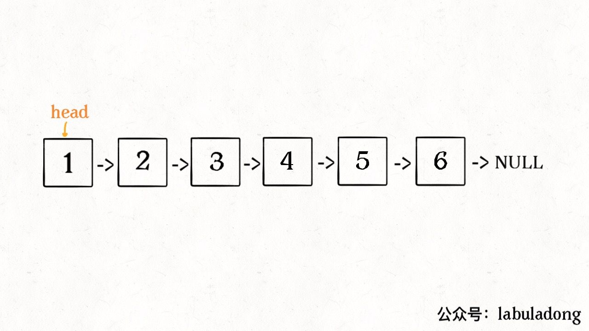
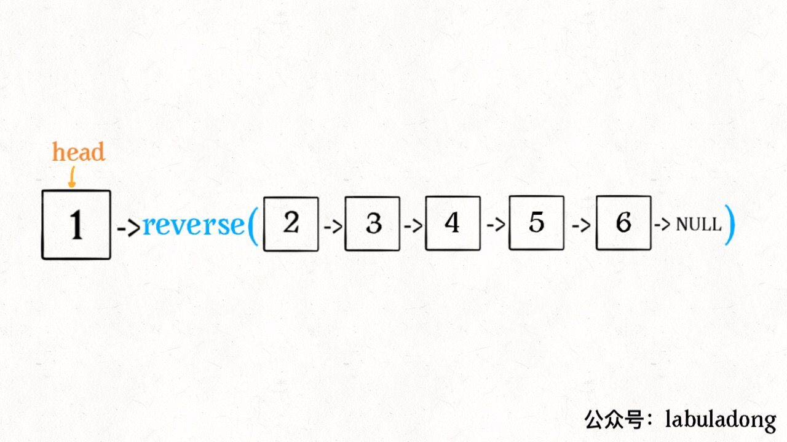
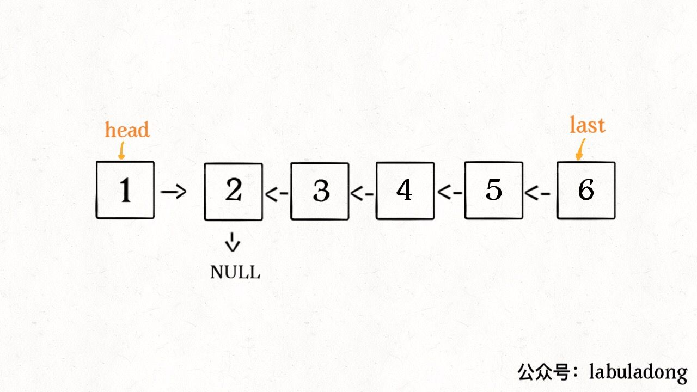
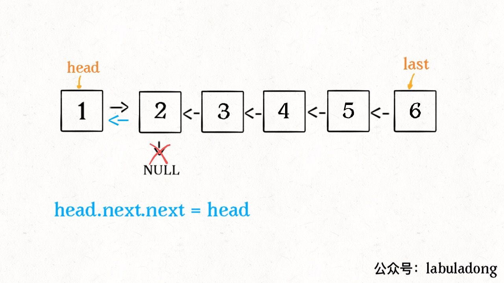
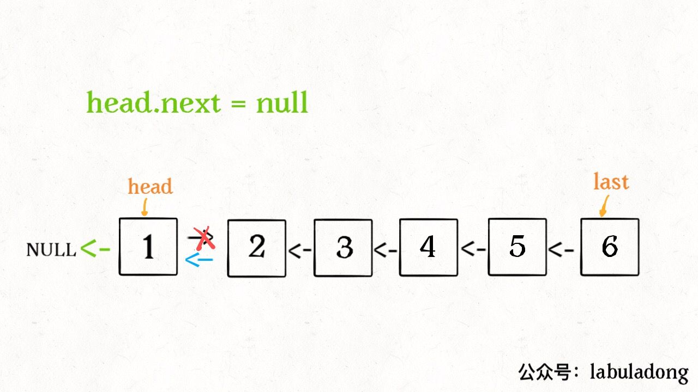

原始链表

```java
ListNode last = reverse(head.next);
```


这个 reverse(head.next) 执行完成后，整个链表就成了这样：

并且根据函数定义，reverse 函数会返回反转之后的头结点，我们用变量 last 接收了。

```java
head.next.next = head;
```


```java
head.next = null;
return last;
```


这样整个链表就反转过来了

两个地方需要注意：  
1、递归函数要有 base case，也就是这句：
```java
if (head.next == null) return head;
```
意思是如果链表只有一个节点的时候反转也是它自己，直接返回即可。

2、当链表递归反转之后，新的头结点是 last，而之前的 head 变成了最后一个节点，别忘了链表的末尾要指向 null：
```java
head.next = null;
```
